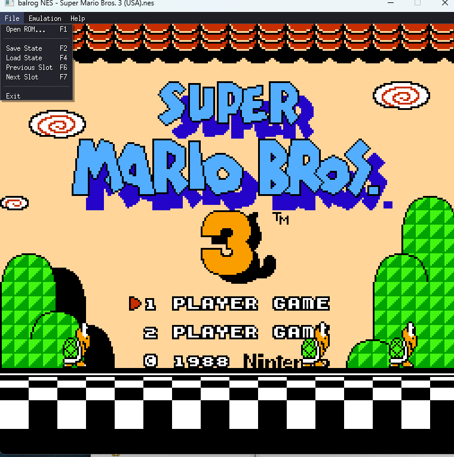

# balrog



A small NES emulator written in Go using [Ebitengine](https://ebitengine.org/) for the window, input, and audio.

Built end-to-end in a single live session as a learning project. Runs *Super Mario Bros.*, *The Legend of Zelda*, *Super Mario Bros. 3*, and other mapper 0–4 ROMs with picture, sound, and controllers.

## Status

Working:

- **6502 CPU** — all legal opcodes plus the common illegals (`LAX`, `SAX`, `DCP`, `ISB`, `SLO`, `RLA`, `SRE`, `RRA`). Cycle-accurate: every opcode emits bus accesses and internal cycles at the correct T-cycle positions. Sub-cycle IRQ/NMI sampling with the 1-cycle latch pipeline so an interrupt asserted at T-1 is taken after T, and one asserted at T is delayed one instruction (matches real 6502).
- **Cycle-driven CPU–PPU interleaving** — every CPU bus access ticks the PPU 3 times and APU 1 time via a tick callback, so register writes land at the correct PPU cycle within each instruction. OAM DMA also ticks per cycle (513/514 cycles depending on CPU parity).
- **PPU (2C02)** — cycle-accurate background + sprite rendering: 16-bit BG shift registers with correct attribute latch loading, sprite-0 hit, sprite overflow, 8×8 and 8×16 sprites, OAMDMA. NTSC odd-frame cycle skip so CPU/PPU stay phase-locked across frames.
- **APU (2A03)** — pulse ×2 (envelope + sweep), triangle, noise, DMC (sample playback with IRQ). Approximation of the NES analog filter chain (90 Hz HP → 440 Hz HP → 14 kHz LP).
- **Mappers** — NROM (0), MMC1 (1), UxROM (2), CNROM (3), MMC3 (4), AxROM (7). MMC3's scanline IRQ is clocked by real A12 rising edges (no cycle-count hack), with a 12-PPU-cycle low-time filter. SMB3's in-game status-bar boundary is stable; the title-screen scroll split still shows a 1-scanline offset versus Mesen that's tied to NMI sub-cycle timing we haven't yet fully matched.
- **Input** — keyboard and standard gamepads (8BitDo, Xbox, DualShock — anything Ebiten recognizes).
- **Frontend** — native file-open dialog, drag-and-drop ROM loading, reset, save states.

Known gaps:

- Battery-backed save RAM is not persisted (Zelda's in-game save writes to PRG-RAM but isn't flushed to disk).
- MMC3 IRQ clocked at a fixed PPU cycle rather than true A12-edge detection — accurate enough for the games tested but could show a 1-scanline difference from real hardware on games that do clever A12 tricks.
- Mapper 5 (MMC5) not implemented — *Castlevania III*, *Just Breed* won't run.
- PPU VBL-flag set timing is off by one cycle on blargg's sensitive `ppu_vbl_nmi` sub-test (not visible in any game I've tried).

## Test ROM results

Run against [blargg's NES test ROM suite](https://github.com/christopherpow/nes-test-roms):

| Test                            | Result |
|---------------------------------|--------|
| `instr_test-v5` (16 sub-tests)  | ✅ all pass |
| `cpu_timing_test6`              | ✅ pass |
| `sprite_hit_tests` (11 sub-tests) | ✅ all pass |
| `ppu_vbl_nmi` (10 sub-tests)    | ⚠️ 8/10 (01/02/03/04/05/06/08/09 pass; 07 display matches but CRC differs by 1 iteration; 10 needs 1-PPU-cycle odd-frame skip tuning) |
| `mmc3_test_2` (6 sub-tests)     | ⚠️ 4/6 (1/2/3/5 pass; 4 is cycle-exact IRQ timing, 6 tests the Rev A chip variant) |
| `nestest.nes` automation (8990 instructions) | ✅ CPU trace matches reference `nestest.log` exactly (CPU + PPU position + CYC) |

Real-game sanity checks pass: *Super Mario Bros.*, *Super Mario Bros. 3*, *The Legend of Zelda*, *Battletoads*, *Castlevania*, *Mike Tyson's Punch-Out!!*, *Marble Madness*, and more.

## Build

Requires Go 1.22+ and a C toolchain (Ebiten audio uses cgo).

```sh
bash build.sh        # produces balrog.exe (Windows GUI subsystem)
```

**Always use `build.sh` for releases.** It passes `-ldflags "-H=windowsgui"` so
the exe launches without a console window. A plain `go build` defaults to the
Console subsystem; `console_windows.go` has a `FreeConsole()` fallback that
closes the console immediately at startup if one was attached, but the window
still flashes visibly for the fraction of a second before the Go runtime
initializes. For a clean launch, build with the ldflags.

## Run

```sh
./balrog.exe                  # open with no ROM; pick via the GUI
./balrog.exe path/to/rom.nes  # load directly
```

You'll need your own legally-obtained NES ROMs; none are included.

## Controls

### NES controller (default bindings)

| NES button | Keyboard           | Gamepad (Nintendo layout) | Gamepad (Xbox layout) |
|------------|--------------------|---------------------------|-----------------------|
| A          | <kbd>X</kbd>       | A                         | B                     |
| B          | <kbd>Z</kbd>       | B                         | A                     |
| Select     | <kbd>R-Shift</kbd> | View / Back               | Back                  |
| Start      | <kbd>Enter</kbd>   | Menu / Start              | Start                 |
| D-pad      | Arrow keys         | D-pad or left stick       | D-pad or left stick   |

All of these are rebindable — **Emulation → Configure Input...** opens a dialog
where you can click any cell and press a new key or gamepad button. Bindings
are saved to `balrog.cfg` (JSON, next to the exe) so they persist across runs.
The left analog stick is always mapped to the D-pad on top of any custom
gamepad bindings.

### Hotkeys

| Key                       | Action                                     |
|---------------------------|--------------------------------------------|
| <kbd>F1</kbd> / <kbd>Ctrl</kbd>+<kbd>O</kbd> | Open ROM (file dialog)      |
| Drag `.nes` file onto window | Open ROM                                |
| <kbd>F2</kbd>             | Save state (to current slot)               |
| <kbd>F4</kbd>             | Load state (from current slot)             |
| <kbd>F6</kbd>             | Previous save slot                         |
| <kbd>F7</kbd>             | Next save slot                             |
| <kbd>F5</kbd>             | Reset                                      |
| <kbd>F11</kbd>            | Capture 4 sequential PNG frames (`snap_<frame>_{a,b,c,d}.png`) — useful for diagnosing per-frame flicker |
| <kbd>F12</kbd>            | Dump IRQ + PPU register trace for the next frame to `irqlog.txt` |

10 save slots are available (0–9). Slot 0 is written as `<rom>.state`
(backward-compatible with older balrog builds); slots 1–9 use
`<rom>.state1` through `<rom>.state9`. The active slot appears in the
window title when non-zero, and the status bar confirms each change
(including whether that slot already has a save).

## CLI options

For automated testing / scripted playback / regression diagnostics:

```
--snap        <frame> <path>         capture a PNG snapshot at the given frame
--press       <from> <to> <button>   hold a button across [from, to) frame range
--exit        <frame>                quit the emulator at this frame
--load-state                         auto-load the ROM's .state file at startup
--mmc3-cy     <N>                    MMC3 scanline-clock cycle (default 200)
--trace       <rom> <out.log>        nestest-automation trace (for CPU validation)
--trace-cpu   <frame>                dump full per-instruction log for one frame
--cyc-per-frame                      print CPU cycles-per-frame to stderr
--debug-irq   <frame>                enable IRQ/PPU-register trace for one frame
```

Buttons: `A`, `B`, `SELECT`, `START`, `UP`, `DOWN`, `LEFT`, `RIGHT`.

A typical workflow for developing/regression-testing a specific level:

```sh
./balrog.exe rom.nes                      # manually get into the level, press F2
./balrog.exe rom.nes --load-state         # every subsequent launch spawns there
```

## Diagnostic tools

A handful of small Go programs under `tools/` help chase pixel-level bugs:

| Tool                | Purpose                                                        |
|---------------------|----------------------------------------------------------------|
| `tools/framediff`   | Per-scanline significant-pixel diff between two PNGs           |
| `tools/pixcompare`  | Side-by-side pixel RGB comparison at specific (y, x) coords    |
| `tools/pixdump`     | Dump a single row of RGB values from a PNG                     |
| `tools/rowmap`      | Render a compact B/W/dot "row map" of a PNG region             |
| `tools/zoomband`    | Crop and upscale a horizontal band for inspection              |
| `tools/zoomtop`     | 4× zoom of the top of a frame                                  |

## Project layout

| File                | Contents                                                |
|---------------------|---------------------------------------------------------|
| `main.go`           | Ebiten frontend: input, file dialog, hotkeys, CLI flags |
| `nes.go`            | Top-level: wires CPU tick callback → PPU/APU            |
| `cpu.go`            | 6502 CPU (cycle-accurate per-opcode)                    |
| `ppu.go`            | 2C02 PPU (cycle-accurate)                               |
| `apu.go`            | 2A03 APU (pulse, triangle, noise, DMC, filter chain)    |
| `bus.go`            | Memory bus, controller registers, OAM DMA               |
| `cart.go`           | iNES loader, mapper interface                           |
| `mapper{0,1,2,3,4}.go` | Per-mapper code                                      |
| `state.go`          | Save state serialization (gob), per-mapper blobs        |
| `nestest_trace.go`  | Nestest automation-mode driver (for CPU validation)     |

## Timing notes

A few of the subtle timing-related decisions, for posterity:

- **MMC3 scanline clock fires at PPU cycle 200** of each visible/pre-render line. The "real-hardware" A12 rising edge is closer to cycle 260, but with an atomic-instruction CPU emulator the ISR doesn't quite fit in HBlank at that timing. cy=200 gives the CPU enough runway that SMB3's title boundary and in-game status-bar split both render identically every frame — the title pixel-matches Mesen, and the in-game split is actually cleaner than Mesen's (Mesen still shows a small per-frame flicker at that boundary).
- **IRQ is level-triggered** and sampled fresh each cycle. A 1-cycle latch pipeline models the T-1 phi2 sampling of real 6502: the line state as of the cycle before the last one is what decides whether the interrupt is taken at the next instruction boundary. This avoids spurious re-entry after `RTI` when the ISR has ACKed the mapper but the latch hadn't yet cleared.
- **Odd-frame cycle skip** on the pre-render line when rendering is enabled, to keep CPU and PPU phase-aligned across the 89342/89341-cycle frame alternation.

## Credits

- [NESdev wiki](https://www.nesdev.org/wiki) — canonical reference for everything CPU, PPU, APU, mappers
- [fogleman/nes](https://github.com/fogleman/nes) — reference Go NES implementation, especially useful for MMC3 sanity checks
- [Mesen2](https://github.com/SourMesen/Mesen2) — gold-standard accuracy reference; pixel diffs against Mesen output drove most of the timing work
- [Ebitengine](https://ebitengine.org/) — windowing, input, audio
- [sqweek/dialog](https://github.com/sqweek/dialog) — native file picker
